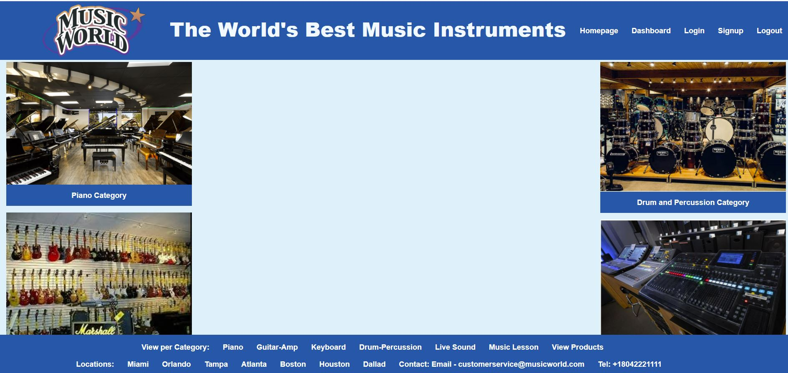
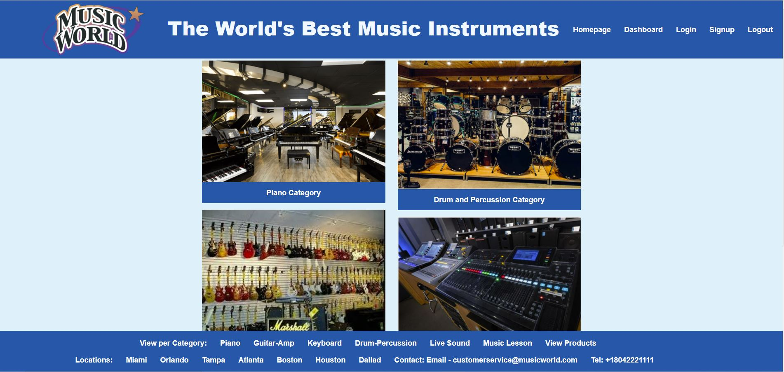
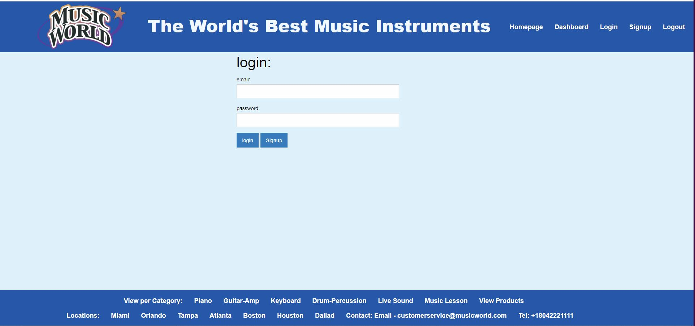
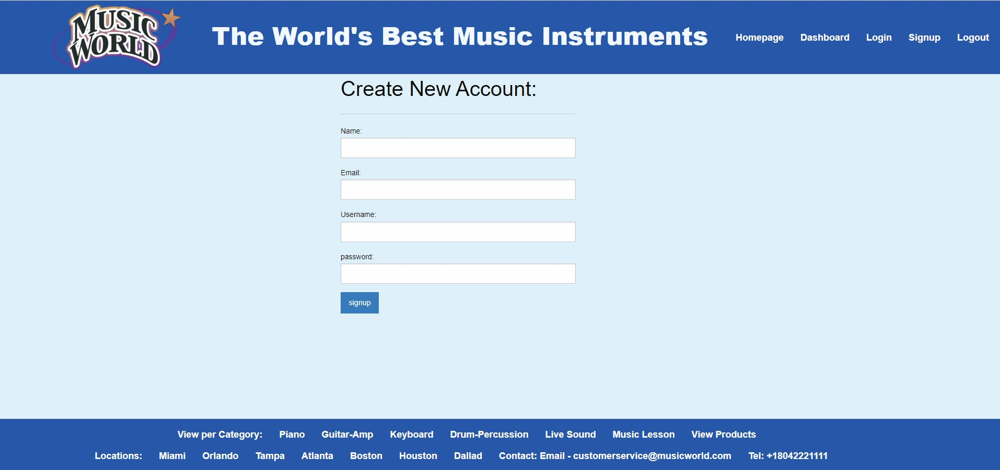
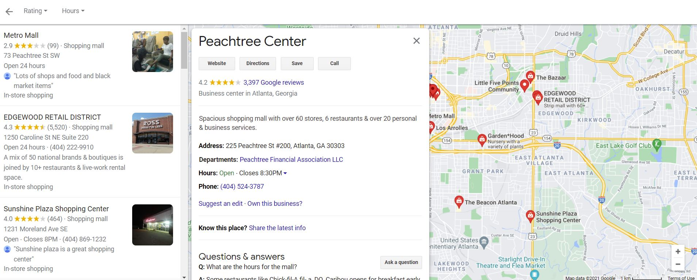
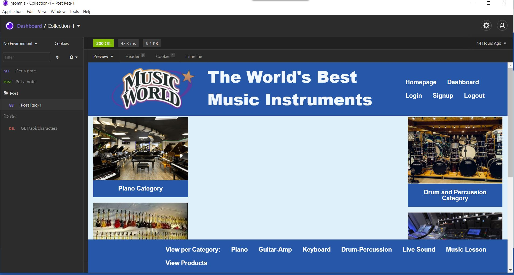

<h1 align="center">Music World E-Commerce 👋</h1>

## Description

*E-Commerce is the backbone of recent age specially in any business in todays world. In this age, people are technology based where the continue most of their works from home. Buying any product from home or selling own product from home remaining remote is one of the best practice naow a days. To facilitate this, Music World E-Commerce application has been developed*


## Table of Contents

- [Description](#description)
- [Table of Contents](#table-of-contents)
- [App Screenshots](#app-screenshots)
- [Overview Links](#overview-links)
- [User Story](#user-story)
- [Acceptance Criteria](#acceptance-criteria)
- [Installation](#installation)
- [Usage](#usage)
- [Contributing](#contributing)
- [Questions](#questions)


## App Screenshots
- Picture of the Home Page of the Application.


- Picture of the Dashboard


- To login to Application



- Signup Option of the Application.


- To Find Our Locations


- View with Insomnia




## Overview Links
- [Application launched in Heroku](https://music-world-ecommerce.herokuapp.com/)
- [Application walkthrough](https://watch.screencastify.com/v/9sRcfDbkBQJnXRCZYhMR)
- [GitHub Repository](https://mirzadev.github.io/music-world-ecommerce/)


## User Story
```text
As a User of e-commerce I want to regularly visit an e-commerce web site where I can view product, it's price, and then decide to purchase my desired product.
```

## Acceptance Criteria

```text
GIVEN a musical instrument e-commerce site
WHEN I visit site
THEN I am presented with the home page with the option- "Homepahe", "Dashboard", Login, Logout and Signup options at the right side of the navbar. Besides the name of the site, it will also display the available categories of the product.
WHEN I click on the homepage option
THEN I am taken to the homepage with the same display as earlier
WHEN I click on the Dashboard
THEN I am prompted to sign in or signup
WHEN I choose to sign up
THEN I am prompted to create a username with email and password
WHEN I click on the sign-up button
THEN my user credentials are saved and I am logged into the site
WHEN I revisit the site at a later time and choose to sign in
THEN I am prompted to enter my email and password
WHEN I am signed in to the site
THEN I see navigation links for the homepage, the dashboard, signup and the option to log out
WHEN I click on the homepage option in the navigation
THEN I am taken to the homepage and presented with existing categories of the product like earlier with the placeholder as empty at the middle
WHEN I click on dashboard
THEN I am presented with the existing categories of the product like earlier which shows in the place holder of the homepage.
WHEN I click on any product category
THEN I am presented with all available products in that category 
WHEN I enter into the site
THEN I see the header and footer fixed in the site in all pages 
WHEN I click on any location on the footer
THEN I am presented with the map location for that branch
WHEN I click on any product category in the footer
THEN I am presented with the available products with picture, description, price and availability of all the products in that category
WHEN I click on view products option in the footer
THEN I am presented with all available products in the store with requires product information
WHEN I click on the logout option in the navigation bar
THEN I am signed out of the site and navigated to the home page of the application
WHEN I am idle on the site for more than a set time
THEN I am automatically loged off from the application.
```

## Installation
💾     
- npm install express-handlebars
- npm install express
- npm install
- npm install --save mysql2
- npm install sequelize
- npm install dotenv
- npm install bcrypt
- npm install express-session
- npm install connect-session-sequelize
- npm install -g nodemon


## Usage
💻   
  
Run the following command at the terminal:

`npm run seeds`
  
`npm start`


## Contributing

:Github Link: [Antonio Rivera](https://github.com/rTonyCloud)
:Github Link: [Mirza Awal](https://github.com/mirzadev)
:Github Link: [Luis A Retana-Gaitan](https://github.com/lretana1)
:Github Link: [Jeremy McGuirk](https://github.com/Jeremymcg88)


## Questions
✉️ Contact me with any questions: [email](mailto:awal.mirza2016@gmail.com) , [LinkedIn](https://www.linkedin.com/in/mirza-awal-5972511b5/)<br />

## Copyright
*This application is copyright protected and only owners are 
:: [Antonio Rivera](https://github.com/rTonyCloud) , 
[Mirza Awal](https://github.com/mirzadev) ,
[Luis A Retana-Gaitan](https://github.com/lretana1) and
[Jeremy McGuirk](https://github.com/Jeremymcg88)*
